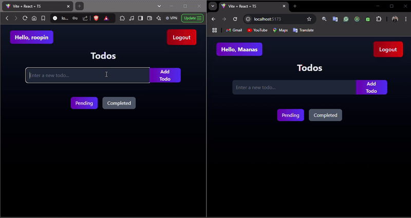

# Collaborative Todo App with Real-Time Features 🎯

A real-time todo application built with React, Redux, and WebSockets, featuring dynamic updates and user authentication. 🔥

## Features ✨

- **Real-Time Updates** 🔄  
  Automatically sync changes across all connected users in real-time using WebSocket technology.

- **Live Previews** 👀  
  Instantly see changes as you type with responsive rendering for todos and UI updates.

- **Cross-Platform Compatibility** 🌐  
  Access the app seamlessly on desktop, tablet, and mobile devices.
## Tech Stack 💻

**Client:**  
- **React** ⚛️: For building the user interface and managing component states.  
- **Redux** : For state management and handling global data efficiently.  
- **TailwindCSS** : For styling the application with utility-first CSS classes.

**Server:**  
- **Node.js** : For backend runtime environment to handle server-side logic.  
- **Express** : For creating and managing APIs to interact with the client and database.
## Installation

### Prerequisites

- Ensure you have **Node.js** and **MongoDB** installed on your system.

### Steps to Install

 **Clone the Repository**:

   ```bash
   git clone https://github.com/Maanas777/Collaborative-Todo.git

   ```
 **Backend setup**:
   ``` bash
   1.cd backend
   2.npm install
```
Create a .env file in the backend directory and add the following environment variables:

 ``` bash
 MONGODB_URI=your_mongodb_connection_string
PORT=5000
JWT_SECRET='Your JWT string '
NODE_ENV=development
```
Start the backend server:

```bash
npm start
```

The backend will run at:
```bash
http://localhost:5000

```

**Frontend Setup**:

   ``` bash
   1.cd ../frontend
   2.npm install
```

Start the frontend development server:

   ``` bash
   npm run dev
```

The frontend will be accessible at:

   ``` bash
 http://localhost:5173

```
## Usage 🚀

Once the application is set up and running, you can interact with the following features:

1. **Signup 📝:**
   - Navigate to the Signup page to create a new user account.
   - Enter your details (username, email, and password) to register.

2. **Login 🔑:**
   - Use your registered credentials to authenticate and log in to the application.

3. **Add Todos ➕:**
   - Use the input box on the home page to create new tasks.
   - Click the "Add" button to save your task.

4. **Filter Tasks 🔍:**
   - Switch between the **Pending** and **Completed** tabs to view tasks by their status.

5. **Mark/Delete Todos 🗑️:**
   - Use the "Delete" button to remove a task.
   - Use the "Mark as Completed" button to update the status of a task.
   - Completed tasks can be viewed in the "Completed" tab.

6. **Real-Time Collaboration ⚡:**
   - Updates made by other users will reflect immediately on your screen, thanks to real-time socket integration.

7. **Logout 🚪:**
   - Click the "Logout" button to safely exit the application.

### Important Notes ⚠️:
- Ensure that both the frontend and backend servers are running simultaneously.
- MongoDB should be running locally or connected via a remote URI to handle the database operations.
## Demo 🎥


